# Agent Playbook

How autonomous AI agents ship work on Resilient without blocking each
other and without a human mediating every decision. This is the
operational companion to [`CLAUDE.md`](../CLAUDE.md) (rules) and
[`agent-scripts/README.md`](../agent-scripts/README.md) (tooling).

Target audience: the agent writing code **and** the orchestrator
spawning agents. A second agent reading this should reach the same
conclusions as the first without talking to them.

---

## 1. Lifecycle of a ticket

```
pick-ticket  →  worktree + claim  →  implement  →  draft PR  →
    ready-or-bail (verify-scope)  →  sweep-drafts (merge)  →  claim released
```

Each step is backed by a script in [`agent-scripts/`](../agent-scripts/).
Stages are idempotent — re-running a stage on the same ticket is a
no-op or safely re-converges.

### Stage details

| Stage | Script | Output |
|---|---|---|
| Pick | `pick-ticket.sh` | `<issue-number>\t<title>\tagent-ready` |
| Dispatch | `dispatch-agent.sh --issue N` | Worktree at `.claude/worktrees/res-N/`, draft PR with `Closes #N` |
| Implement | (agent free-form) | Follow feature-isolation pattern in CLAUDE.md |
| Verify | `ready-or-bail.sh --pr P` | PR marked ready (green) or stays draft with failure comment (red) |
| Sweep | `sweep-drafts.sh --go` | Merge green PRs, auto-resolve append-only conflicts |
| Release | CI (`release-file-claims.yml`) | `agent-scripts/file-claims.json` cleared for the branch |

---

## 2. Coordination without communication

Two agents working concurrently must converge without talking to each
other. We achieve this with three mechanisms:

### 2a. File claims (`agent-scripts/file-claims.json`)

A JSON ledger of `{ "file-path": "branch-name" }`. Every agent:

1. Before editing core files, runs
   `agent-scripts/claim-files.sh <branch> <file>...`.
2. Before *dispatching* a new ticket, runs
   `agent-scripts/check-overlaps.sh <file>...` to refuse work that
   would collide with an active claim or an open PR.

Claims are automatically released by
[`.github/workflows/release-file-claims.yml`](../.github/workflows/release-file-claims.yml)
on PR merge, and by `agent-scripts/release-claims.sh` locally when a
branch is abandoned.

**Stale-claim rule**: any claim older than 30 minutes (measured by the
commit timestamp on the claim-adding commit on `main`) is treated as
abandoned. A new dispatcher may overwrite it. This is enforced by
`check-overlaps.sh` treating stale entries as absent.

### 2b. Append-only extension points

`resilient/src/{main.rs,typechecker.rs,lexer_logos.rs}` are shared by
every feature. They contain explicit comment markers:

```rust
// <EXTENSION_TOKENS>
// <EXTENSION_KEYWORDS>
// <EXTENSION_PASSES>
```

**All** cross-feature edits to these files go inside those blocks, and
the blocks are **append-only** (new lines are always added to the end,
never inserted mid-block, never reordered). Two agents appending to
the same block produce a mechanical merge conflict that is always
resolved by keeping both sides.

[`agent-scripts/auto-resolve-extensions.sh`](../agent-scripts/auto-resolve-extensions.sh)
does exactly that. It refuses to run on any file outside the allowlist
(the three core files plus `file-claims.json`), so it can't quietly
corrupt logic code.

### 2c. Live branches (pull-before-push, every commit)

Every agent pushes to its feature branch immediately after every
commit (`CLAUDE.md` push policy). Before pushing, the agent runs
`git fetch origin main` and, if `main` has advanced, rebases or
`gh pr update-branch`s before continuing. This keeps branches within
seconds of `main` and means every conflict surfaces at the smallest
possible scope.

**Concrete rule for implementers**: after every `git commit`, run
`git push`. Before starting any new edit session on an existing
branch, run `git fetch origin main && git rebase origin/main` (or
`gh pr update-branch <pr>` if you prefer the merge-commit strategy).

---

## 3. Conflict-resolution protocol

When `gh pr update-branch` reports conflicts:

```
# Step 1: sync the branch into a local worktree.
git fetch origin
git checkout <branch>
git merge origin/main          # produces conflict markers

# Step 2: classify the conflicts.
git diff --name-only --diff-filter=U

# Step 3: if ALL conflict files are in the allowlist, auto-resolve.
agent-scripts/auto-resolve-extensions.sh <files>
git add <files>
git commit --no-edit
git push

# Step 4: if any conflict is outside the allowlist, STOP.
#         Post a comment on the PR and hand off to a human or a
#         sonnet-tier agent with enough context to do it by hand.
```

The auto-resolver refuses to touch files outside the allowlist, so a
mistaken invocation is a no-op error rather than silent corruption.

---

## 4. Cost tiers — model routing

Pick the cheapest model that can do the job. The orchestrator chooses
the tier; the agent itself does not escalate.

| Tier | Model | Use for |
|---|---|---|
| **Scrape** | Haiku | `gh issue list`, `gh pr list`, picking tickets, reading status JSON |
| **Default** | Sonnet | Feature implementation, lexer/parser changes, typechecker rules, docs, test authoring, merge-conflict auto-resolve |
| **Heavy** | Opus | Z3 verifier passes, SMT encodings, refinement-type inference, any algorithm where correctness depends on subtle mathematical reasoning |

Rules of thumb:

- If the ticket title starts with `lexer:`, `parser:`, `stdlib:`,
  `lsp:`, `lint:`, `repl:`, `cli:`, `docs:` → **Sonnet**.
- If it mentions `smt`, `z3`, `proof`, `refinement`, `verifier`,
  `liveness`, `bounded model check` → **Opus**.
- Orchestration, PR sweeping, ticket triage → **Haiku**.

**Do not** run Opus loops for scraping or Haiku for SMT work.

---

## 5. Anti-patterns (hard NO)

These violate the rules in `CLAUDE.md`. CI will reject them; the
guardrail will keep the PR in draft.

- **Modifying existing tests** to make a PR green. Fix the code.
- **Deleting or weakening an assertion** — treated identically to
  deleting the test.
- **Force-pushing** a reviewed branch. Use `gh pr update-branch` (a
  merge commit) instead.
- **Bypassing CI** (`--no-verify`, skipping hooks).
- **Adding `unsafe`** without a soundness justification comment.
- **Adding a dependency** without stating why in the PR.
- **Touching `.github/workflows/`** outside a workflow-specific ticket.
- **Half-landing a feature** with a `TODO` — finish or scope a
  follow-up ticket.

---

## 6. Orchestrator flow (summary)

```dot
digraph orchestrator {
    rankdir=LR;
    pick     [label="pick-ticket.sh"];
    dispatch [label="dispatch-agent.sh"];
    impl     [label="sub-agent\n(sonnet/opus)"];
    verify   [label="ready-or-bail.sh"];
    sweep    [label="sweep-drafts.sh"];
    release  [label="release-file-claims\n(CI)"];

    pick -> dispatch -> impl -> verify -> sweep -> release;
    verify -> impl [label="fail\n(comment, stay draft)"];
    sweep  -> verify [label="CI red"];
}
```



One command to drain the queue:

```bash
agent-scripts/orchestrator.sh --loop
```

One command to land the already-done work:

```bash
agent-scripts/sweep-drafts.sh --go
```

---

## 7. When two agents don't talk

A reminder of how the system survives an unsupervised second agent:

- They can't both claim the same file (`claim-files.sh` is atomic).
- They can't both pick the same ticket (`pick-ticket.sh` excludes
  tickets referenced by any open PR).
- They can both touch the same extension block; the resolver handles
  it.
- They can both push to the same branch — but they won't, because
  `dispatch-agent.sh` creates a new worktree per ticket.
- Their PRs are merged by whichever `sweep-drafts.sh` runs next; the
  earlier PR just lands first and the later one picks up the new
  `main` via `gh pr update-branch`.

The contract is: **the ledger, the extension points, and the ticket
system are the only shared state.** Everything else is agent-local.
