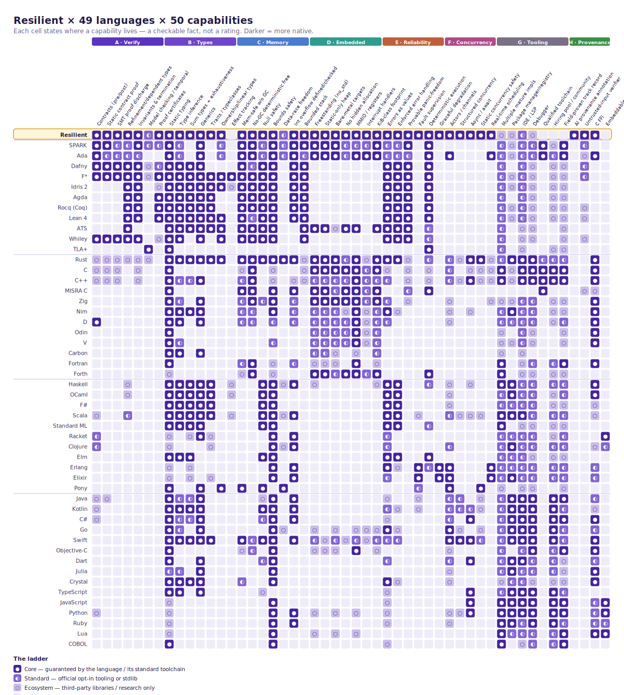

# The language capability matrix

> **This is not a scoreboard of opinions.** Every cell answers one factual, checkable question: *where does this capability live for this language?* — baked into the language, bolted on through official tooling, reachable only via third-party libraries, or absent. The tiers below are defined precisely enough that any cell is falsifiable: cite the rule and the language's official documentation.



*The full 50×50 grid. Resilient is the highlighted top row; capabilities are grouped into eight themes left-to-right; languages are grouped by family top-to-bottom.*

## The tier ladder

| | Tier | What it means |
|---|---|---|
| ● | **Core** | Guaranteed by the language definition / type system or its single standard toolchain. A conforming program cannot opt out. |
| ◐ | **Standard** | Available via official / first-party tooling or standard library, but opt-in — not enforced by the core language. |
| ○ | **Ecosystem** | Achievable only through third-party libraries, external tools, or research prototypes; not part of the language or its official tooling. |
| · | **None** | Absent, or fundamentally incompatible with the language model. |

The ladder measures **provenance, not quality**. “Core” does not mean *good* and “Ecosystem” does not mean *bad* — a mature third-party library can be more battle-tested than a young built-in. It means exactly what it says: how *native* the capability is. Two layers of backing make each cell defensible — one universal ladder, plus a per-capability rule (shown in each section) stating what earns each tier **for that specific capability**.

## Resilient at a glance

Across all 50 capabilities, Resilient rates **39 ● Core**, **3 ◐ Standard**, **3 ○ Ecosystem**, and **5 · None**. It concentrates its Core tiers in verification, memory/embedded safety, fault handling, and AI-code provenance — and is honestly **weakest on ecosystem maturity** (Theme G): a single young implementation, a nascent registry, no qualified toolchain, and no field track record yet. That gap is a fact about the language's age, not its design.

## Capabilities by theme

### A &middot; Verification & Contracts

| Language | Contracts (pre/post) | Static contract proof | SMT proof discharge | Refinement/dependent types | Invariants & termination | Model checking / temporal | Proof certificates |
|---|:-:|:-:|:-:|:-:|:-:|:-:|:-:|
| **Resilient** | ● | ● | ● | ● | ● | ◐ | ● |
| SPARK | ● | ● | ◐ | ◐ | ● | ◐ | ◐ |
| Ada | ● | ◐ | ◐ | ◐ | ◐ | · | · |
| Dafny | ● | ● | ● | ● | ● | ○ | ◐ |
| F* | ● | ● | ● | ● | ● | ○ | ● |
| Idris 2 | · | · | · | ● | ● | · | ○ |
| Agda | · | · | · | ● | ● | · | ● |
| Rocq (Coq) | · | · | · | ● | ● | · | ● |
| Lean 4 | · | · | · | ● | ● | · | ● |
| ATS | · | · | · | ● | · | · | · |
| Whiley | ● | ● | ● | ● | ● | · | ○ |
| TLA+ | · | · | · | · | · | ● | · |
| Rust | ○ | ○ | ○ | ○ | ○ | ○ | · |
| C | ○ | ○ | ○ | · | ○ | · | · |
| C++ | ○ | ○ | ○ | · | ○ | · | · |
| MISRA C | · | · | · | · | · | · | · |
| Zig | · | · | · | · | · | · | · |
| Nim | · | · | · | · | · | · | · |
| D | ● | · | · | · | · | · | · |
| Odin | · | · | · | · | · | · | · |
| V | · | · | · | · | · | · | · |
| Carbon | · | · | · | · | · | · | · |
| Fortran | · | · | · | · | · | · | · |
| Forth | · | · | · | · | · | · | · |
| Haskell | · | · | · | ○ | · | · | · |
| OCaml | · | · | · | ○ | · | · | · |
| F# | · | · | · | · | · | · | · |
| Scala | ○ | · | · | ◐ | · | · | · |
| Standard ML | · | · | · | · | · | · | · |
| Racket | ◐ | · | · | · | · | · | · |
| Clojure | ◐ | · | · | · | · | · | · |
| Elm | · | · | · | · | · | · | · |
| Erlang | · | · | · | · | · | · | · |
| Elixir | · | · | · | · | · | · | · |
| Pony | · | · | · | · | · | · | · |
| Java | ○ | ○ | · | · | · | · | · |
| Kotlin | ○ | · | · | · | · | · | · |
| C# | ○ | · | · | · | · | · | · |
| Go | · | · | · | · | · | · | · |
| Swift | · | · | · | · | · | · | · |
| Objective-C | · | · | · | · | · | · | · |
| Dart | · | · | · | · | · | · | · |
| Julia | · | · | · | · | · | · | · |
| Crystal | · | · | · | · | · | · | · |
| TypeScript | · | · | · | · | · | · | · |
| JavaScript | · | · | · | · | · | · | · |
| Python | ○ | · | · | · | · | · | · |
| Ruby | · | · | · | · | · | · | · |
| Lua | · | · | · | · | · | · | · |
| COBOL | · | · | · | · | · | · | · |

<details><summary>Tier rules &amp; notes for this theme</summary>

**Contracts (pre/post)** — Design-by-contract (pre/post)  
*Rule:* Core: requires/ensures/invariant (or in/out) are language keywords. Standard: ships in the official stdlib/first-party tool as opt-in. Ecosystem: third-party library only. None: none.  
*Reading:* Design-by-contract is core in Resilient, where requires/ensures/recovers_to are first-class keywords, alongside SPARK/Ada (Pre/Post aspects) and D (in/out contract blocks). Most mainstream languages have only assertions or third-party contract libraries.  

**Static contract proof** — Static (compile-time) contract proof  
*Rule:* Core: the standard toolchain refuses to build a program whose contracts it cannot discharge (or demands an explicit proof). Standard: an official separate verifier proves them opt-in. Ecosystem: third-party verifier. None: contracts checked only at runtime, or absent.  
*Reading:* Static compile-time contract proof is core in Resilient: the bundled Z3 verifier refuses to build a program whose obligations it cannot discharge, as with Dafny, F*, Whiley and SPARK (GNATprove). In most languages contracts, if present, are only checked at runtime.  

**SMT proof discharge** — SMT / automated proof discharge  
*Rule:* Core: an SMT/automated solver is invoked by the standard toolchain to discharge proof obligations. Standard: an official tool integrates a solver opt-in. Ecosystem: third-party integration. None.  
*Reading:* SMT/automated proof discharge is core in Resilient, whose standard toolchain invokes a bundled Z3 solver; Dafny, F* and Whiley likewise drive SMT solvers as part of their build. SPARK/Ada integrate solvers via the official but opt-in GNATprove tool.  

**Refinement/dependent types** — Refinement / dependent types  
*Rule:* Core: types may carry logical predicates or depend on values as part of the language. Standard: an official extension/mode. Ecosystem: library or plugin. None.  
*Reading:* Refinement/dependent types are core in Resilient via #[refinement] predicate types, dependent-length arrays and ghost types, joining the dependently-typed family (Idris, Agda, Coq, Lean, F*, ATS) and refinement-typed Dafny/Whiley. In Haskell/Rust they live in libraries (LiquidHaskell etc.).  

**Invariants & termination** — Loop invariants & termination checking  
*Rule:* Core: the language accepts/uses loop invariants and proves or checks termination. Standard: an official tool does. Ecosystem: third-party. None.  
*Reading:* Loop-invariant and termination checking is core in Resilient, which runs dedicated invariant and termination passes, as in Dafny, F*, Whiley and SPARK. Proof assistants like Coq, Lean and Agda enforce termination as a soundness requirement.  

**Model checking / temporal** — Model checking / temporal specs  
*Rule:* Core: temporal/state specifications are part of the language and checked by its toolchain. Standard: a first-party model checker. Ecosystem: third-party. None.  
*Reading:* Model checking is standard in Resilient via first-party bridges to TLA+ and stateright plus liveness/distributed-invariant verifiers, whereas TLA+ makes temporal model checking its entire core toolchain (TLC/Apalache). Most languages have nothing here.  

**Proof certificates** — Machine-checkable proof certificates  
*Rule:* Core: the toolchain emits an independently re-checkable proof/certificate artifact. Standard: an official tool can export one. Ecosystem: third-party. None.  
*Reading:* Machine-checkable proof certificates are core in Resilient, which emits signed, independently re-checkable SMT-LIB2 certificates; Coq, Lean, Agda and F* produce independently checkable proof terms as their core artifact.  

</details>

### B &middot; Type System

| Language | Static typing | Type inference | Sum types + exhaustiveness | Generics | Traits / typeclasses | Ownership/linear types | Effect tracking |
|---|:-:|:-:|:-:|:-:|:-:|:-:|:-:|
| **Resilient** | ● | ● | ● | ● | ● | ● | · |
| SPARK | ● | ◐ | · | ● | · | ◐ | · |
| Ada | ● | ◐ | · | ● | · | ◐ | · |
| Dafny | ● | ● | ● | ● | · | · | · |
| F* | ● | ● | ● | ● | ● | ● | ● |
| Idris 2 | ● | ● | ● | ● | ● | ● | ○ |
| Agda | ● | ● | ● | ● | ● | · | · |
| Rocq (Coq) | ● | ● | ● | ● | ● | · | · |
| Lean 4 | ● | ● | ● | ● | ● | ● | · |
| ATS | ● | ● | ● | ● | ● | ● | · |
| Whiley | ● | ● | · | ● | · | ● | · |
| TLA+ | ● | · | · | · | · | · | · |
| Rust | ● | ● | ● | ● | ● | ● | · |
| C | ● | · | · | · | · | · | · |
| C++ | ● | ◐ | ◐ | ● | · | · | · |
| MISRA C | ● | · | · | · | · | · | · |
| Zig | ● | ◐ | · | ● | · | · | · |
| Nim | ● | ● | ● | ● | · | · | · |
| D | ● | ● | · | ● | · | · | · |
| Odin | ● | · | · | · | · | · | · |
| V | ● | ◐ | · | · | · | · | · |
| Carbon | ● | ● | · | ● | · | · | · |
| Fortran | ● | · | · | · | · | · | · |
| Forth | ○ | · | · | · | · | · | · |
| Haskell | ● | ● | ● | ● | ● | · | ○ |
| OCaml | ● | ● | ● | ● | ● | · | ○ |
| F# | ● | ● | ● | ● | ● | · | · |
| Scala | ● | ● | ● | ● | ● | · | ○ |
| Standard ML | ● | ● | ● | ● | · | · | · |
| Racket | ○ | · | ○ | ● | ○ | · | · |
| Clojure | ○ | · | · | · | ○ | · | · |
| Elm | ● | ● | ● | · | · | · | · |
| Erlang | ○ | · | ○ | · | · | · | · |
| Elixir | ○ | · | ○ | · | ○ | · | · |
| Pony | ● | · | · | ● | · | ● | · |
| Java | ● | ◐ | ◐ | ● | · | · | · |
| Kotlin | ● | ● | ● | ● | · | · | · |
| C# | ● | ◐ | ◐ | ● | · | · | · |
| Go | ● | ◐ | · | ● | · | · | · |
| Swift | ● | ● | ● | ● | ● | · | · |
| Objective-C | ● | · | · | · | · | · | · |
| Dart | ● | · | · | ● | · | · | · |
| Julia | ◐ | ◐ | · | ● | · | · | · |
| Crystal | ● | ● | ● | ● | · | · | · |
| TypeScript | ● | ● | · | ● | · | · | · |
| JavaScript | ○ | · | · | · | · | · | · |
| Python | ○ | · | · | · | · | · | · |
| Ruby | ○ | · | · | · | · | · | · |
| Lua | ○ | · | · | · | · | · | · |
| COBOL | ● | · | · | · | · | · | · |

<details><summary>Tier rules &amp; notes for this theme</summary>

**Static typing** — Static typing  
*Rule:* Core: statically typed by definition. Standard: an official static checker for an otherwise dynamic language (opt-in). Ecosystem: third-party checker. None: dynamic only.  
*Reading:* Static typing is core in Resilient (and most compiled languages). TypeScript is core (its own static language); Python/JS/Ruby/Lua are dynamic, with only third-party checkers (mypy, Sorbet) at the ecosystem tier.  

**Type inference** — Type inference  
*Rule:* Core: local (or global) type inference built into the language. Standard: official opt-in inference. Ecosystem: third-party. None.  
*Reading:* Type inference is core in Resilient via built-in Hindley-Milner-style local inference, as in Haskell/OCaml/ML/Rust. C++/Java/C#/Go offer only limited local inference (auto/var/:=), placed at standard.  

**Sum types + exhaustiveness** — Sum types + exhaustiveness  
*Rule:* Core: tagged unions/enums with compiler-checked exhaustive matching. Standard: official library/opt-in. Ecosystem: third-party. None.  
*Reading:* Sum types with compiler-checked exhaustive match are core in Resilient, Rust, Haskell, OCaml and Swift. Go has none; C#/Java (sealed + patterns) and C++ (std::variant) are standard rather than true core tagged unions.  

**Generics** — Generics / parametric polymorphism  
*Rule:* Core: parametric polymorphism in the language. Standard: official opt-in mechanism. Ecosystem: third-party. None.  
*Reading:* Generics/parametric polymorphism are core in Resilient (monomorphized generic structs and enums) and in Rust/C++/Haskell/Java/C#/Swift and Go (since 1.18). Dynamic languages lack a type system so are none.  

**Traits / typeclasses** — Traits / typeclasses (ad-hoc poly)  
*Rule:* Core: typeclasses/traits/protocols for principled ad-hoc polymorphism in the language. Standard: official library. Ecosystem: third-party. None (only subtyping/overloading).  
*Reading:* Traits/typeclasses are core in Resilient (impl Trait for Type, inheritance, default methods, associated constants, blanket impls, static dispatch), like Haskell typeclasses and Rust/Swift traits. Go interfaces and Java/C# interfaces are subtyping, not principled ad-hoc polymorphism (none).  

**Ownership/linear types** — Ownership / linear / affine types  
*Rule:* Core: linear/affine/ownership tracking enforced by the type system. Standard: official opt-in mode. Ecosystem: third-party checker. None.  
*Reading:* Resilient enforces linear/uniqueness typing and region inference in the type system (though not a full Rust-style borrow checker), so it is core alongside Rust (ownership) and Pony (reference capabilities). ATS/Idris2/Lean have linear/quantitative types core.  

**Effect tracking** — Effect system / effect tracking  
*Rule:* Core: side effects tracked in the type system. Standard: official opt-in effect facility. Ecosystem: third-party. None.  
*Reading:* Effect tracking is where Resilient is honestly weak: it has information-flow/taint tracking but not a general algebraic effect system, so it is none. F* tracks effects in its types (core); Haskell/Scala effect systems are library-based (ecosystem).  

</details>

### C &middot; Memory & Safety

| Language | Mem-safe w/o GC | No-GC deterministic free | Null safety | Bounds safety | Data-race freedom | Int overflow defined/checked | Bounded stack |
|---|:-:|:-:|:-:|:-:|:-:|:-:|:-:|
| **Resilient** | ● | ● | ● | ● | ◐ | ● | ● |
| SPARK | ● | ● | ◐ | ● | ◐ | ● | ● |
| Ada | ● | ● | ◐ | ● | ◐ | ● | ◐ |
| Dafny | ● | ◐ | ● | ● | · | ● | ● |
| F* | ● | ● | ● | ● | · | ● | ● |
| Idris 2 | ● | ● | ● | ● | · | ● | ● |
| Agda | ● | ● | ● | ● | · | ● | ● |
| Rocq (Coq) | ● | ● | ● | ● | · | ● | ● |
| Lean 4 | ● | ◐ | ● | ● | · | ● | ● |
| ATS | ● | ● | ● | ● | · | · | ● |
| Whiley | ● | ● | ● | ● | · | · | ● |
| TLA+ | · | · | · | · | · | · | · |
| Rust | ● | ● | ● | ● | ● | ● | ○ |
| C | ○ | ● | · | ○ | · | · | ○ |
| C++ | ◐ | ● | · | ○ | · | ○ | ○ |
| MISRA C | ● | ● | · | ● | · | ● | · |
| Zig | ◐ | ● | ◐ | ● | · | ◐ | · |
| Nim | ◐ | ◐ | · | ● | · | ◐ | · |
| D | ◐ | ◐ | · | ◐ | · | ◐ | · |
| Odin | · | · | · | · | · | · | · |
| V | · | · | · | ◐ | · | · | · |
| Carbon | · | · | · | · | · | · | · |
| Fortran | ◐ | ● | · | ○ | · | ◐ | · |
| Forth | ○ | ● | · | ○ | · | · | · |
| Haskell | · | · | ● | ● | ○ | ● | · |
| OCaml | · | · | ● | ● | · | · | · |
| F# | · | · | ● | ● | · | · | · |
| Scala | · | · | ● | ● | ○ | ● | · |
| Standard ML | · | · | ● | ● | · | · | · |
| Racket | · | · | · | ● | · | ● | · |
| Clojure | · | · | · | ● | ○ | ● | · |
| Elm | · | · | ● | ● | · | · | · |
| Erlang | · | · | · | ● | · | ● | · |
| Elixir | · | · | · | ● | · | ● | · |
| Pony | ● | · | ● | · | ● | · | · |
| Java | · | · | ○ | ● | · | ● | · |
| Kotlin | · | · | ● | ● | · | ● | · |
| C# | · | · | ◐ | ● | · | ● | · |
| Go | · | · | · | ● | ○ | · | · |
| Swift | ● | ◐ | ● | ● | · | ● | · |
| Objective-C | ○ | ◐ | · | ● | · | · | · |
| Dart | · | · | ◐ | ● | · | · | · |
| Julia | · | · | · | ● | · | · | · |
| Crystal | ◐ | · | · | ● | · | · | · |
| TypeScript | · | · | ○ | · | · | · | · |
| JavaScript | · | · | · | ● | · | · | · |
| Python | · | · | · | ● | · | ● | · |
| Ruby | · | · | · | ● | · | ● | · |
| Lua | · | · | · | ● | · | · | · |
| COBOL | · | · | · | ● | · | · | · |

<details><summary>Tier rules &amp; notes for this theme</summary>

**Mem-safe w/o GC** — Memory safety without a GC  
*Rule:* Core: memory-safe in safe code WITHOUT a garbage collector, by language design. Standard: a safe subset/mode without GC. Ecosystem: safety only via external sanitizers/analyzers. None: unsafe by default, or safety depends on a GC.  
*Reading:* Memory safety without a GC is core in Resilient by design (static-only heap, no null, bounds + stack budgets), alongside Rust/Ada/SPARK/Pony/Swift. C/C++ are unsafe by default (bounds only via sanitizers = ecosystem); GC languages are omitted because their safety depends on a collector.  

**No-GC deterministic free** — No-GC / deterministic deallocation  
*Rule:* Core: default execution model has no garbage collector; deallocation is deterministic. Standard: an official no-GC mode. Ecosystem: third-party. None: mandatory GC.  
*Reading:* No-GC deterministic deallocation is core in Resilient (no collector in the default model), like Rust/C/C++/Ada/Zig. Swift uses deterministic ARC (standard); Nim/D/Crystal ship a GC by default with an official no-GC mode (standard); mandatory-GC languages are none.  

**Null safety** — Compile-time null safety  
*Rule:* Core: no null, or nullability tracked in the type system and checked. Standard: official nullable annotations + checker. Ecosystem: third-party analyzer. None.  
*Reading:* Compile-time null safety is core in Resilient (no null; Option/never-type), like Rust, Swift optionals and the ML/functional families. C#/Dart have official opt-in nullable checkers (standard); TypeScript strictNullChecks and Java analyzers are opt-in/third-party (ecosystem).  

**Bounds safety** — Bounds safety by default  
*Rule:* Core: no out-of-bounds access in safe code (checked or proven) by default. Standard: default-on checks that can be disabled. Ecosystem: external tooling. None: unchecked by default.  
*Reading:* Bounds safety by default is core in Resilient (checked, plus dependent-length arrays that catch OOB at compile time) and in most checked/managed languages. C/C++/Forth are unchecked by default with bounds only via sanitizers (ecosystem).  

**Data-race freedom** — Data-race freedom (compile-time)  
*Rule:* Core: the compiler statically prevents data races. Standard: an official opt-in checker. Ecosystem: third-party. None: races possible / caught only at runtime.  
*Reading:* Compile-time data-race freedom: Resilient is standard — it has an actor model plus lock-ordering/deadlock analysis but not a whole-language guarantee (first-slice). Only Pony (reference capabilities) and Rust (Send/Sync) prevent data races language-wide (core).  

**Int overflow defined/checked** — Integer overflow defined or checked  
*Rule:* Core: integer overflow is defined or checked by default (trap/wrap/error is specified). Standard: default-on checks that can be disabled. Ecosystem: external. None: undefined behaviour.  
*Reading:* Integer overflow is defined-or-checked (never silently undefined) as core in Resilient (saturating arithmetic + numeric checks), like Rust, Ada/SPARK (trap) and managed languages. C++ signed overflow is undefined (ecosystem).  

**Bounded stack** — Bounded stack / recursion control  
*Rule:* Core: stack usage is bounded/analyzable and unbounded recursion is controlled by the language. Standard: an official stack-analysis tool. Ecosystem: third-party. None.  
*Reading:* Bounded stack / recursion control is core in Resilient via #[max_stack(bytes=N)] and stack budgets, alongside SPARK and the total/dependently-typed proof languages. Most mainstream languages have no built-in bound (Rust none; C/C++ only via third-party analyzers).  

</details>

### D &middot; Embedded & Bare-Metal

| Language | Freestanding (no_std) | Static-only heap | Bare-metal targets | No hidden allocation | MMIO / registers | Interrupt handlers | KiB-class footprint |
|---|:-:|:-:|:-:|:-:|:-:|:-:|:-:|
| **Resilient** | ● | ● | ● | ● | ● | ● | ● |
| SPARK | ● | ● | ● | ◐ | ◐ | ◐ | ● |
| Ada | ● | ● | ● | ◐ | ● | ● | ● |
| Dafny | · | · | · | · | · | · | · |
| F* | · | · | · | · | · | · | · |
| Idris 2 | · | · | · | · | · | · | · |
| Agda | · | · | · | · | · | · | · |
| Rocq (Coq) | · | · | · | · | · | · | · |
| Lean 4 | · | · | · | · | · | · | · |
| ATS | ● | ● | ○ | ● | ● | · | ● |
| Whiley | · | · | · | · | · | · | · |
| TLA+ | · | · | · | · | · | · | · |
| Rust | ● | ● | ● | ◐ | ● | ○ | ● |
| C | ● | ● | ● | ● | ● | ◐ | ● |
| C++ | ◐ | ◐ | ◐ | ◐ | ● | ◐ | ◐ |
| MISRA C | ● | ● | ◐ | ● | ● | ◐ | ● |
| Zig | ● | ● | ● | ● | ● | ◐ | ● |
| Nim | ◐ | ◐ | ◐ | ○ | ● | ○ | ◐ |
| D | ◐ | ◐ | ◐ | ◐ | ● | ○ | ◐ |
| Odin | ◐ | ◐ | ◐ | ◐ | ● | ○ | ◐ |
| V | ◐ | ◐ | ◐ | ◐ | ● | ○ | ◐ |
| Carbon | ◐ | ◐ | ○ | · | ○ | · | ◐ |
| Fortran | ○ | ○ | ○ | · | ● | · | ○ |
| Forth | ● | ● | ◐ | ● | ● | ◐ | ● |
| Haskell | ○ | · | · | · | · | · | ○ |
| OCaml | · | · | · | · | · | · | · |
| F# | · | · | · | · | · | · | · |
| Scala | · | · | · | · | · | · | · |
| Standard ML | · | · | · | · | · | · | · |
| Racket | · | · | · | · | · | · | · |
| Clojure | · | · | · | · | · | · | · |
| Elm | · | · | · | · | · | · | · |
| Erlang | · | · | · | · | · | · | · |
| Elixir | · | · | · | · | · | · | · |
| Pony | · | · | · | · | · | · | · |
| Java | · | · | · | · | · | · | · |
| Kotlin | · | · | · | · | · | · | · |
| C# | · | · | · | · | · | · | · |
| Go | ○ | · | ○ | · | ○ | ○ | ○ |
| Swift | ◐ | ○ | ◐ | ○ | ◐ | ○ | ◐ |
| Objective-C | ○ | ○ | ○ | · | ● | · | ○ |
| Dart | · | · | · | · | · | · | · |
| Julia | · | · | · | · | · | · | · |
| Crystal | · | · | · | · | · | · | · |
| TypeScript | · | · | · | · | · | · | · |
| JavaScript | · | · | · | · | · | · | · |
| Python | ○ | · | ○ | · | ○ | · | · |
| Ruby | · | · | · | · | · | · | · |
| Lua | ○ | · | ○ | · | ○ | · | · |
| COBOL | · | · | · | · | · | · | · |

<details><summary>Tier rules &amp; notes for this theme</summary>

**Freestanding (no_std)** — Freestanding / no runtime (no_std)  
*Rule:* Core: runs with no OS and no language runtime by design. Standard: an official no-runtime/freestanding mode. Ecosystem: third-party port. None: requires a runtime/VM.  
*Reading:* Freestanding / no-runtime (no_std) is core in Resilient, whose #![no_std] runtime needs no OS or language runtime — like C, Rust, Zig, Ada/SPARK and Forth. Managed/VM languages reach bare metal only via ports (MicroPython, TinyGo = ecosystem).  

**Static-only heap** — Zero / opt-out heap (static-only)  
*Rule:* Core: can run with no heap allocation, enforceable by the toolchain. Standard: an official no-alloc profile. Ecosystem: third-party discipline. None.  
*Reading:* Zero / opt-out heap is core in Resilient (static-only mode, toolchain-enforced), like C, Rust no_std, Zig (explicit allocators) and Ada restriction pragmas. GC/VM languages cannot opt out of the heap (none).  

**Bare-metal targets** — Bare-metal cross-compile (Cortex-M/RISC-V)  
*Rule:* Core: bare-metal MCU targets are first-class in the official toolchain. Standard: official cross-compilation, community MCU support. Ecosystem: only via a third-party backend/port. None.  
*Reading:* Bare-metal Cortex-M / RISC-V is core in Resilient, whose CI cross-compiles thumbv7em/thumbv6m and riscv32imac as first-class targets, like Rust and Zig. C is core via gcc/clang; TinyGo/MicroPython are ecosystem ports.  

**No hidden allocation** — Deterministic, no hidden allocation  
*Rule:* Core: no hidden heap/runtime allocations; costs are visible by design. Standard: an official mode/lint. Ecosystem: third-party discipline. None: pervasive hidden allocation.  
*Reading:* Deterministic, no-hidden-allocation is core in Resilient (#[no_alloc] certificates), like C, Zig and Forth where costs are explicit. Rust guarantees no hidden heap in no_std but std types allocate implicitly (standard). GC/VM languages are none.  

**MMIO / registers** — MMIO / register-level hardware access  
*Rule:* Core: direct memory-mapped IO / volatile register access in the language. Standard: an official HAL/register abstraction. Ecosystem: third-party crates/libs. None.  
*Reading:* MMIO / register access is core in Resilient (#[mmio_regmap] with overlap detection + volatile), as most systems languages expose volatile pointer access directly. Register-map abstractions are often ecosystem crates, but raw MMIO is core.  

**Interrupt handlers** — First-class interrupt handlers  
*Rule:* Core: ISRs are a language/attribute feature. Standard: an official mechanism/library. Ecosystem: third-party. None.  
*Reading:* First-class interrupt handlers are core in Resilient (isr_call_graph analysis) and Ada (interrupt attach / protected objects). C/C++ use compiler attributes (standard); Rust's #[interrupt] and most HALs are ecosystem crates.  

**KiB-class footprint** — Small footprint (KiB-class .text)  
*Rule:* Core: produces KiB-class binaries with no runtime by design. Standard: achievable with official flags. Ecosystem: only with heavy third-party stripping. None: MB-class runtime required.  
*Reading:* KiB-class footprint is core in Resilient (a .text ≤ 64 KiB CI budget for the Cortex-M4F demo), like C, Rust no_std, Zig, Ada and Forth. GC/VM languages need MB-class runtimes (none).  

</details>

### E &middot; Reliability & Fault Handling

| Language | Errors as values | Enforced error handling | Provable panic-freedom | Fault supervision | Deterministic execution | Graceful degradation |
|---|:-:|:-:|:-:|:-:|:-:|:-:|
| **Resilient** | ● | ● | ● | ● | ● | ● |
| SPARK | ◐ | ◐ | ● | · | ● | · |
| Ada | ◐ | ◐ | ◐ | · | ● | · |
| Dafny | ● | ● | ● | · | ● | · |
| F* | ● | ● | ● | · | ● | · |
| Idris 2 | ● | ● | ● | · | ● | · |
| Agda | ● | ● | ● | · | ● | · |
| Rocq (Coq) | ● | ● | ● | · | ● | · |
| Lean 4 | ● | ● | ● | · | ● | · |
| ATS | ● | ● | ● | · | ◐ | · |
| Whiley | ● | ● | ● | · | ◐ | · |
| TLA+ | · | · | · | · | ● | · |
| Rust | ● | ● | ○ | · | ◐ | · |
| C | ○ | · | ○ | · | ○ | · |
| C++ | ◐ | · | ○ | · | ○ | · |
| MISRA C | · | · | ◐ | · | ● | · |
| Zig | ◐ | · | ○ | · | · | · |
| Nim | ● | ○ | · | · | · | · |
| D | ◐ | · | · | · | · | · |
| Odin | · | · | · | · | · | · |
| V | · | · | · | · | · | · |
| Carbon | · | · | · | · | · | · |
| Fortran | · | · | · | · | · | · |
| Forth | · | · | · | · | ● | · |
| Haskell | ● | ● | · | · | ◐ | · |
| OCaml | ● | ● | · | · | · | · |
| F# | ● | ● | · | · | · | · |
| Scala | ● | ● | · | ○ | · | · |
| Standard ML | ● | ● | · | · | ◐ | · |
| Racket | ◐ | · | · | · | · | · |
| Clojure | ◐ | · | · | · | · | · |
| Elm | ● | ● | · | · | ● | · |
| Erlang | ● | ○ | · | ● | ◐ | ● |
| Elixir | ◐ | · | · | ● | · | ● |
| Pony | · | · | · | ◐ | · | · |
| Java | ○ | · | · | ○ | · | · |
| Kotlin | ◐ | ○ | · | ○ | · | · |
| C# | ○ | · | · | · | · | · |
| Go | ● | ○ | · | · | · | · |
| Swift | ◐ | ◐ | · | · | · | · |
| Objective-C | · | · | · | · | · | · |
| Dart | ◐ | · | · | · | · | · |
| Julia | · | · | · | · | · | · |
| Crystal | ● | ○ | · | · | · | · |
| TypeScript | ○ | · | · | · | · | · |
| JavaScript | ○ | · | · | · | · | · |
| Python | ○ | · | · | · | · | · |
| Ruby | ○ | · | · | · | · | · |
| Lua | · | · | · | · | · | · |
| COBOL | ○ | · | · | · | · | · |

<details><summary>Tier rules &amp; notes for this theme</summary>

**Errors as values** — Errors as values (no default exceptions)  
*Rule:* Core: the idiomatic error model is values (Result/Option/tagged), not thrown exceptions. Standard: an official result type used alongside exceptions. Ecosystem: third-party. None: exceptions-by-default.  
*Reading:* Errors as values is core in Resilient (Result/Option + the ? operator), like Rust and the ML/functional family. Swift/Kotlin ship an official Result type (standard); Java/C#/Python/JS default to thrown exceptions (ecosystem-level result types).  

**Enforced error handling** — Exhaustive error handling enforced  
*Rule:* Core: the compiler forces handling of error/failure cases. Standard: an official opt-in lint/checker. Ecosystem: third-party linter. None.  
*Reading:* Enforced exhaustive error handling is core in Resilient (exhaustive match + coverage warnings), like Rust and the exhaustive-match functional family (Elm strictest). Go can silently ignore errors, so only ecosystem errcheck exists.  

**Provable panic-freedom** — Panic-free guarantee (provable)  
*Rule:* Core: absence of panics/aborts/uncaught exceptions is provable or enforced by the toolchain. Standard: an official tool proves it. Ecosystem: third-party. None.  
*Reading:* Provable panic-freedom is core in Resilient (#[no_panic] certification; zero-panic no_std runtime) and SPARK (proves absence of runtime errors). Rust's panic-freedom is only the ecosystem no_panic crate.  

**Fault supervision** — Fault recovery / supervision  
*Rule:* Core: the language/runtime supervises and recovers from faults (self-healing blocks / supervisor trees). Standard: an official supervision library. Ecosystem: third-party. None.  
*Reading:* Fault recovery / supervision is core in Resilient — the flagship live { } self-healing blocks plus supervisor trees and recovers_to contracts — matched only by Erlang/Elixir OTP supervision. On the JVM, Akka is ecosystem-only.  

**Deterministic execution** — Deterministic / reproducible execution  
*Rule:* Core: execution is deterministic/reproducible by design (no unspecified evaluation order, no nondeterministic GC pauses in the model). Standard: an official deterministic mode. Ecosystem: third-party. None.  
*Reading:* Deterministic execution is core in Resilient by design, alongside SPARK/Ada, the proof languages, TLA+ and pure Elm. C/C++ have unspecified evaluation order requiring discipline (ecosystem).  

**Graceful degradation** — Redundancy / graceful degradation primitives  
*Rule:* Core: built-in redundancy/fallback/last-known-good constructs. Standard: an official library. Ecosystem: third-party pattern. None.  
*Reading:* Graceful-degradation primitives are core in Resilient (degraded_mode, saturation_required, backpressure_safe + live-block last-known-good restoration) and in Erlang/Elixir OTP. They are essentially absent elsewhere.  

</details>

### F &middot; Concurrency

| Language | Actors / channels | Structured concurrency | Async / await | Static concurrency safety | Real-time scheduling |
|---|:-:|:-:|:-:|:-:|:-:|
| **Resilient** | ● | ● | ● | ● | ● |
| SPARK | · | · | · | · | · |
| Ada | ● | · | · | · | ● |
| Dafny | · | · | · | · | · |
| F* | · | · | · | · | · |
| Idris 2 | · | · | · | · | · |
| Agda | · | · | · | · | · |
| Rocq (Coq) | · | · | · | · | · |
| Lean 4 | · | · | · | · | · |
| ATS | · | · | · | · | · |
| Whiley | · | · | · | · | · |
| TLA+ | · | · | · | · | · |
| Rust | ◐ | ○ | ● | ● | ○ |
| C | ◐ | · | ○ | ○ | ○ |
| C++ | ◐ | ○ | ● | ○ | ○ |
| MISRA C | · | · | · | · | · |
| Zig | ○ | · | · | · | ○ |
| Nim | ○ | · | ○ | · | · |
| D | ○ | · | · | · | · |
| Odin | · | · | · | · | · |
| V | · | · | · | · | · |
| Carbon | · | · | · | · | · |
| Fortran | · | · | · | · | · |
| Forth | · | · | · | · | · |
| Haskell | ○ | · | ○ | · | · |
| OCaml | ○ | · | · | · | · |
| F# | ○ | · | · | · | · |
| Scala | ◐ | ○ | ○ | ○ | · |
| Standard ML | · | · | · | · | · |
| Racket | · | · | · | · | · |
| Clojure | ◐ | · | · | · | · |
| Elm | · | · | · | · | · |
| Erlang | ● | · | · | · | ● |
| Elixir | ● | · | · | · | ● |
| Pony | ● | · | · | ● | · |
| Java | ◐ | ◐ | · | ○ | · |
| Kotlin | ◐ | ◐ | ◐ | ○ | · |
| C# | ◐ | · | ● | · | · |
| Go | ● | ○ | · | ○ | · |
| Swift | ● | ● | ● | ◐ | · |
| Objective-C | ○ | · | · | · | · |
| Dart | ◐ | · | ● | · | · |
| Julia | ○ | · | · | · | · |
| Crystal | ○ | · | · | · | · |
| TypeScript | · | · | ● | · | · |
| JavaScript | · | · | ● | · | · |
| Python | ○ | ○ | ● | · | · |
| Ruby | ○ | · | · | · | · |
| Lua | · | · | · | · | · |
| COBOL | · | · | · | · | · |

<details><summary>Tier rules &amp; notes for this theme</summary>

**Actors / channels** — Message-passing / actor model  
*Rule:* Core: actors or channels are a language primitive. Standard: an official concurrency library. Ecosystem: third-party. None.  
*Reading:* Message-passing / actors are core in Resilient (actors + mailboxes + drain + an actor verifier), like Erlang/Elixir/Pony/Go and Swift/Ada. Rust/C/C++ expose channels/threads via stdlib (standard).  

**Structured concurrency** — Structured concurrency  
*Rule:* Core: structured concurrency (scoped task lifetimes) in the language. Standard: an official library. Ecosystem: third-party. None.  
*Reading:* Structured concurrency is core in Resilient via bounded-blocking and backpressure-safe constructs (first-slice), alongside Swift task groups. Kotlin coroutines and Java's preview are official libraries (standard); Go/Rust/Python rely on third-party (errgroup, trio).  

**Async / await** — Async / await  
*Rule:* Core: async/await syntax in the language. Standard: an official async library/runtime. Ecosystem: third-party. None.  
*Reading:* Async/await syntax is core in Resilient (state-machine transform + scheduler hook), like Rust/C#/JS/TS/Python/Swift/Dart and C++20 coroutines. Kotlin's lives in the official coroutines library (standard).  

**Static concurrency safety** — Compile-time deadlock / race prevention  
*Rule:* Core: the compiler statically prevents deadlocks or data races in concurrent code. Standard: an official opt-in checker. Ecosystem: third-party. None.  
*Reading:* Compile-time deadlock/race prevention is core in Resilient (lock-order graph with cycles as hard errors, priority-inversion detection), like Rust (Send/Sync) and Pony. Swift actor isolation/Sendable is an opt-in standard checker.  

**Real-time scheduling** — Real-time scheduling support  
*Rule:* Core: real-time constructs/priorities/deadlines in the language or its standard runtime. Standard: an official real-time profile. Ecosystem: third-party RTOS bindings. None.  
*Reading:* Real-time scheduling support is core in Resilient (#[wcet(cycles=N)] contracts, watchdog-feed, power budgets) and Ada (Ravenscar). Erlang/Elixir provide soft-real-time scheduling; Rust/C/C++ rely on third-party RTOS bindings (ecosystem).  

</details>

### G &middot; Tooling & Ecosystem Maturity

| Language | Multiple mature impls | Package manager/registry | IDE / LSP | Debugger | Qualified toolchain | Hiring pool / community | Field-proven track record |
|---|:-:|:-:|:-:|:-:|:-:|:-:|:-:|
| **Resilient** | ○ | ○ | ◐ | ○ | · | · | · |
| SPARK | ◐ | ○ | ◐ | ◐ | ● | ○ | ● |
| Ada | ◐ | ○ | ◐ | ◐ | ● | ◐ | ● |
| Dafny | ◐ | · | ◐ | ○ | · | ○ | ○ |
| F* | ◐ | ○ | ◐ | ○ | · | ○ | ○ |
| Idris 2 | ◐ | ○ | ◐ | ○ | · | ○ | ○ |
| Agda | ◐ | · | ◐ | ○ | · | ○ | ○ |
| Rocq (Coq) | ◐ | ○ | ◐ | ○ | · | ○ | ○ |
| Lean 4 | ◐ | ○ | ◐ | ○ | · | ○ | ○ |
| ATS | ◐ | · | ○ | ○ | · | · | ○ |
| Whiley | ◐ | · | ○ | ○ | · | · | ○ |
| TLA+ | ◐ | · | ○ | · | · | ○ | ○ |
| Rust | ◐ | ● | ● | ● | ◐ | ◐ | ◐ |
| C | ● | ○ | ● | ● | ● | ● | ● |
| C++ | ● | ○ | ● | ● | ● | ● | ● |
| MISRA C | · | · | · | · | ● | · | · |
| Zig | ○ | ○ | ◐ | ◐ | · | ○ | ○ |
| Nim | ◐ | ● | ◐ | ◐ | · | ○ | ○ |
| D | ◐ | ◐ | ◐ | ◐ | · | ○ | ◐ |
| Odin | ○ | · | ◐ | ○ | · | · | ○ |
| V | ○ | ○ | ◐ | ○ | · | · | ○ |
| Carbon | ○ | · | ○ | · | · | · | · |
| Fortran | ● | · | ○ | ◐ | · | ◐ | ● |
| Forth | ● | · | ○ | ○ | · | ○ | ○ |
| Haskell | ● | ● | ◐ | ◐ | · | ◐ | ◐ |
| OCaml | ◐ | ● | ◐ | ◐ | · | ○ | ◐ |
| F# | ◐ | ◐ | ◐ | ◐ | · | ○ | ○ |
| Scala | ● | ● | ● | ◐ | · | ◐ | ◐ |
| Standard ML | ● | · | ○ | ○ | · | ○ | ○ |
| Racket | ◐ | ◐ | ◐ | ◐ | · | ○ | ◐ |
| Clojure | ◐ | ● | ◐ | ◐ | · | ◐ | ◐ |
| Elm | ◐ | ◐ | ◐ | ○ | · | ○ | ○ |
| Erlang | ◐ | ◐ | ◐ | ◐ | · | ◐ | ◐ |
| Elixir | ◐ | ● | ◐ | ◐ | · | ◐ | ◐ |
| Pony | ○ | · | ○ | ○ | · | · | ○ |
| Java | ◐ | ● | ● | ● | · | ● | ● |
| Kotlin | ◐ | ● | ● | ● | · | ● | ◐ |
| C# | ◐ | ● | ● | ● | · | ● | ● |
| Go | ◐ | ● | ● | ● | · | ● | ◐ |
| Swift | ◐ | ● | ● | ● | · | ● | ◐ |
| Objective-C | ◐ | · | ◐ | ● | · | ◐ | ● |
| Dart | ◐ | ● | ● | ◐ | · | ◐ | ○ |
| Julia | ◐ | ● | ◐ | ◐ | · | ◐ | ○ |
| Crystal | ○ | ◐ | ◐ | ○ | · | ○ | ○ |
| TypeScript | ◐ | ● | ● | ● | · | ● | ◐ |
| JavaScript | ● | ● | ● | ● | · | ● | ● |
| Python | ● | ● | ● | ● | · | ● | ● |
| Ruby | ● | ● | ◐ | ● | · | ● | ◐ |
| Lua | ● | ◐ | ◐ | ◐ | · | ◐ | ● |
| COBOL | ● | · | ○ | ◐ | · | ◐ | ● |

<details><summary>Tier rules &amp; notes for this theme</summary>

**Multiple mature impls** — Multiple mature compilers / implementations  
*Rule:* Core: two or more independent, production-grade implementations. Standard: one mature reference implementation. Ecosystem: a single young or experimental implementation. None.  
*Reading:* Multiple mature implementations: Resilient is ecosystem — a single young reference compiler, no second independent impl. C/C++/JS/Python/Ruby/Fortran have several mature compilers (core); Rust/Go/Java have one industrial impl (standard).  

**Package manager/registry** — Package manager + registry  
*Rule:* Core: an official package manager AND a widely-used registry. Standard: an official manager with a community registry. Ecosystem: third-party managers only. None.  
*Reading:* Package manager + registry: Resilient is ecosystem — it has an official manager (rz.toml, semver, publish) but no established public registry yet. cargo/npm/pip/maven back core; C/C++/Ada lack a single official manager+registry.  

**IDE / LSP** — IDE / LSP support  
*Rule:* Core: official LSP server plus first-party IDE integration. Standard: an official or de-facto LSP server. Ecosystem: community-only tooling. None.  
*Reading:* IDE / LSP: Resilient is standard — it ships an official LSP server, but first-party IDE integration is still early. Mainstream languages pair official LSP with deep first-party IDE support (core).  

**Debugger** — Debugger / step-through tooling  
*Rule:* Core: a first-class, widely-used debugger with source stepping. Standard: an official/de-facto debugger. Ecosystem: partial or third-party. None.  
*Reading:* Debugger / step-through: Resilient is ecosystem — a debugger module + DAP server exist, but source stepping is still emerging. gdb/lldb-class debuggers put the mainstream languages at core.  

**Qualified toolchain** — Certified / qualified toolchain  
*Rule:* Core: a qualified compiler/toolchain for DO-178C / ISO 26262 / IEC 61508 is commercially available. Standard: a qualification kit or documented process exists. Ecosystem: qualification in progress or third-party evidence. None.  
*Reading:* Certified/qualified toolchain: Resilient is none — it explicitly does not claim DO-178C / ISO 26262 / IEC 61508 conformance and qualification has not started. Ada/SPARK (GNAT Pro), qualified C/C++ and MISRA C toolchains are core; Rust's Ferrocene is standard.  

**Hiring pool / community** — Large hiring pool / community  
*Rule:* Core: a large global talent pool. Standard: a sizable niche community. Ecosystem: a small but real community. None: negligible.  
*Reading:* Hiring pool / community: Resilient is none — a tiny pre-production community. Mainstream languages have large global pools (core); Rust/Scala/Clojure/Julia are sizable niches (standard).  

**Field-proven track record** — Production track record (field-proven)  
*Rule:* Core: decades of safety-critical field deployment. Standard: years of production use. Ecosystem: early adopters / niche production. None: pre-production.  
*Reading:* Production track record: Resilient is none — pre-production, no safety-critical field deployments. C/C++/Ada/SPARK/COBOL/Fortran have decades in the field (core); Rust/Go/Swift have years of production use (standard).  

</details>

### H &middot; Provenance & Interop

| Language | AI provenance annotation | Untrusted-input verifier | C FFI | Embeddable in host apps |
|---|:-:|:-:|:-:|:-:|
| **Resilient** | ● | ● | ● | · |
| SPARK | · | ◐ | · | · |
| Ada | · | ○ | ● | · |
| Dafny | · | ◐ | · | · |
| F* | · | ◐ | · | · |
| Idris 2 | · | · | · | · |
| Agda | · | · | · | · |
| Rocq (Coq) | · | ○ | · | · |
| Lean 4 | · | ○ | · | · |
| ATS | · | · | · | · |
| Whiley | · | ○ | · | · |
| TLA+ | · | · | · | · |
| Rust | · | · | ● | · |
| C | · | · | ● | · |
| C++ | · | · | ● | · |
| MISRA C | · | ○ | ○ | · |
| Zig | · | · | ● | · |
| Nim | · | · | ● | · |
| D | · | · | ● | · |
| Odin | · | · | ● | · |
| V | · | · | ● | · |
| Carbon | · | · | · | · |
| Fortran | · | · | ● | · |
| Forth | · | · | · | · |
| Haskell | · | · | ● | · |
| OCaml | · | · | ● | · |
| F# | · | · | ○ | · |
| Scala | · | · | ○ | · |
| Standard ML | · | · | · | · |
| Racket | · | · | · | ● |
| Clojure | · | · | ○ | ◐ |
| Elm | · | · | · | · |
| Erlang | · | · | ◐ | · |
| Elixir | · | · | ◐ | · |
| Pony | · | · | · | · |
| Java | · | · | ◐ | · |
| Kotlin | · | · | ○ | · |
| C# | · | · | ● | · |
| Go | · | · | ◐ | · |
| Swift | · | · | ● | · |
| Objective-C | · | · | ● | · |
| Dart | · | · | ◐ | · |
| Julia | · | · | ● | · |
| Crystal | · | · | ● | · |
| TypeScript | · | · | · | · |
| JavaScript | · | · | ◐ | ● |
| Python | · | · | ◐ | ● |
| Ruby | · | · | ◐ | ◐ |
| Lua | · | · | ● | ● |
| COBOL | · | · | · | · |

<details><summary>Tier rules &amp; notes for this theme</summary>

**AI provenance annotation** — AI-generated-code provenance / attestation  
*Rule:* Core: the language records/attests the provenance of generated code as a first-class construct. Standard: an official tool tracks it. Ecosystem: third-party. None.  
*Reading:* AI-generated-code provenance is essentially unique to Resilient: #[generated(intent, prompt_hash)] records provenance as a first-class language construct. No other mainstream language has a language-level attestation construct for generated code (editor plugins and commit conventions do not count).  

**Untrusted-input verifier** — Untrusted-by-default verification of generated code  
*Rule:* Core: the toolchain re-derives every safety claim from the typed AST and treats generated/asserted code as untrusted input. Standard: an official tool does. Ecosystem: third-party. None.  
*Reading:* Untrusted-by-default verification of generated code is core in Resilient: the compiler + Z3 + TLA+ re-derive every safety claim from the typed AST, treating AI output as untrusted input. SPARK/Dafny/F* re-derive safety from source for any code, including generated (standard).  

**C FFI** — C FFI / interop  
*Rule:* Core: a built-in C foreign-function interface. Standard: an official FFI library. Ecosystem: third-party binding generators. None.  
*Reading:* C FFI is core in Resilient (extern fn, trampolines, variadic bindings), as in most systems languages plus Fortran (ISO_C_BINDING), Ada, Julia (ccall) and Lua (C API). Go (cgo), Python (ctypes), Java (JNI/Panama) are official but opt-in (standard).  

**Embeddable in host apps** — Embeddable in / interoperable with host apps  
*Rule:* Core: designed to embed inside a host application (as a scripting/extension layer). Standard: an official embedding API. Ecosystem: third-party embedding. None.  
*Reading:* Embeddability as a host scripting layer is where Resilient is none: it is a compiled systems language with a REPL/JIT but not designed to embed as a guest. Lua is the canonical embeddable language; JS engines, CPython and Racket ship embedding APIs (core).  

</details>

## Every language, tallied

| Language | Family | ● Core | ◐ Standard | ○ Ecosystem | · None |
|---|---|:-:|:-:|:-:|:-:|
| **Resilient** | resilient | 39 | 3 | 3 | 5 |
| SPARK | proof | 18 | 17 | 2 | 13 |
| Ada | proof | 19 | 17 | 2 | 12 |
| Dafny | proof | 18 | 5 | 4 | 23 |
| F* | proof | 23 | 3 | 5 | 19 |
| Idris 2 | proof | 18 | 2 | 6 | 24 |
| Agda | proof | 18 | 2 | 3 | 27 |
| Rocq (Coq) | proof | 18 | 2 | 5 | 25 |
| Lean 4 | proof | 18 | 3 | 5 | 24 |
| ATS | proof | 20 | 2 | 4 | 24 |
| Whiley | proof | 17 | 2 | 5 | 26 |
| TLA+ | proof | 3 | 1 | 3 | 43 |
| Rust | systems | 25 | 7 | 11 | 7 |
| C | systems | 15 | 2 | 14 | 19 |
| C++ | systems | 12 | 11 | 13 | 14 |
| MISRA C | systems | 12 | 3 | 2 | 33 |
| Zig | systems | 11 | 8 | 7 | 24 |
| Nim | systems | 9 | 10 | 7 | 24 |
| D | systems | 6 | 15 | 3 | 26 |
| Odin | systems | 3 | 6 | 4 | 37 |
| V | systems | 3 | 8 | 5 | 34 |
| Carbon | systems | 3 | 3 | 4 | 40 |
| Fortran | systems | 6 | 4 | 6 | 34 |
| Forth | systems | 8 | 2 | 7 | 33 |
| Haskell | functional | 13 | 5 | 7 | 25 |
| OCaml | functional | 11 | 4 | 4 | 31 |
| F# | functional | 9 | 4 | 4 | 33 |
| Scala | functional | 13 | 5 | 8 | 24 |
| Standard ML | functional | 9 | 1 | 4 | 36 |
| Racket | functional | 4 | 7 | 4 | 35 |
| Clojure | functional | 3 | 9 | 4 | 34 |
| Elm | functional | 8 | 3 | 3 | 36 |
| Erlang | functional | 7 | 8 | 3 | 32 |
| Elixir | functional | 7 | 7 | 3 | 33 |
| Pony | functional | 8 | 1 | 4 | 37 |
| Java | mainstream | 9 | 6 | 6 | 29 |
| Kotlin | mainstream | 11 | 6 | 5 | 28 |
| C# | mainstream | 11 | 5 | 2 | 32 |
| Go | mainstream | 9 | 4 | 9 | 28 |
| Swift | mainstream | 17 | 10 | 3 | 20 |
| Objective-C | mainstream | 6 | 4 | 6 | 34 |
| Dart | mainstream | 6 | 7 | 1 | 36 |
| Julia | mainstream | 4 | 6 | 2 | 38 |
| Crystal | mainstream | 7 | 3 | 6 | 34 |
| TypeScript | mainstream | 8 | 2 | 2 | 38 |
| JavaScript | mainstream | 9 | 1 | 2 | 38 |
| Python | mainstream | 10 | 1 | 8 | 31 |
| Ruby | mainstream | 6 | 4 | 3 | 37 |
| Lua | mainstream | 5 | 4 | 4 | 37 |
| COBOL | mainstream | 4 | 2 | 2 | 42 |

## How to dispute a cell

Found one you disagree with? Good — that is the point of defining the tiers. Open an issue citing (1) the capability's **rule**, (2) the **language's official documentation**, and (3) which tier you believe applies. Because every rating is a claim about provenance rather than taste, disagreements resolve against evidence, not vibes.

## Regenerating

The grid and every table on this page are generated from [`data/language_matrix.json`](https://github.com/EricSpencer00/Resilient/blob/main/data/language_matrix.json) by [`scripts/gen_matrix.py`](https://github.com/EricSpencer00/Resilient/blob/main/scripts/gen_matrix.py):

```bash
python3 scripts/gen_matrix.py
```
